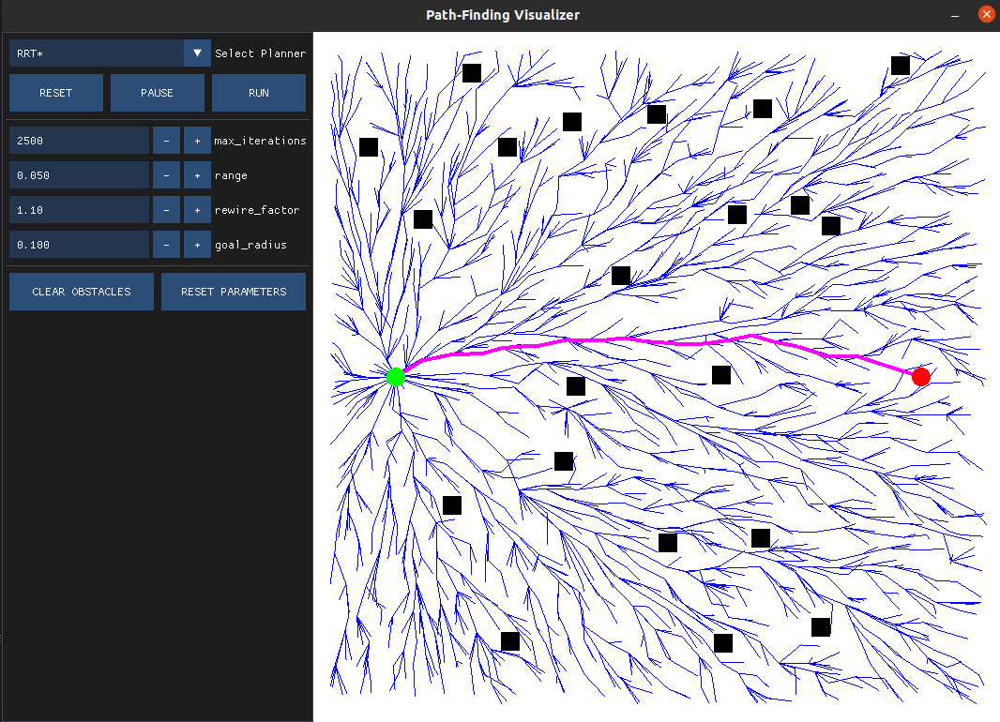
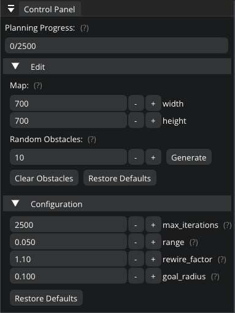
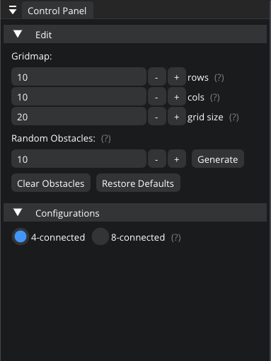

Pathfinding Visualizer
=====

A tool for visualizing numerous pathfinding algorithms in two dimensions.

This project involves minimal implementations of the popular planning algorithms, including both graph-based and sampling-based planners. We provide an easy-to-use GUI to control the animation process and explore different planner configurations. Current implementation of the project involves four search-based planning algorithms: BFS, DFS, DIJKSTRA and A-Star and two sampling-based planners: RRT and RRT*. The project extensively uses SFML, ImGui and Modern C++ features such as smart pointers, lamda expressions along with multi-threading concepts.

 

## Dependencies

* cmake >= 3.14
  * All OSes: [click here for installation instructions](https://cmake.org/install/)
* make >= 4.1 (Linux, Mac), 3.81 (Windows)
  * Linux: make is installed by default on most Linux distros
  * Mac: [install Xcode command line tools to get make](https://developer.apple.com/xcode/features/)
  * Windows: [Click here for installation instructions](http://gnuwin32.sourceforge.net/packages/make.htm)
* gcc/g++ >= 5.4
  * Linux: gcc / g++ is installed by default on most Linux distros
  * Mac: same deal as make - [install Xcode command line tools](https://developer.apple.com/xcode/features/)
  * Windows: recommend using [MinGW](http://www.mingw.org/)

## Basic Build Instructions

The project depends on [SFML](https://github.com/SFML/SFML), [Dear ImGui](https://github.com/ocornut/imgui) and [ImGui-SFML](https://github.com/eliasdaler/imgui-sfml). However, you are not required to install external dependencies by yourself. The following build instructions will manage all the necessary external dependencies for you.

1. Clone this repo.
2. Make a build directory in the top level project directory: `mkdir build && cd build`
3. Compile: `cmake .. && make`
4. Run it: `./main`.

## TODO

### Graph-based planners
- [x] BFS
- [x] DFS
- [x] DIJKSTRA
- [x] A*
- [ ] Bidirectional-A*
- [ ] D*
- [ ] LPA*

### Sampling-based planners
- [x] RRT
- [ ] RRT-Connect
- [x] RRT*
- [ ] Informed-RRT*
- [ ] FMT*
- [ ] BIT*
- [ ] ABIT*
- [ ] AIT*

## Related Publications
- [DIJKSTRA](https://ir.cwi.nl/pub/9256/9256D.pdf): A Note on Two Problems in Connexion with Graphs
- [A*](https://ieeexplore.ieee.org/abstract/document/4082128?casa_token=0ltx8josfO0AAAAA:nA2z0T2qvr00C6rIhIM3Z7GhWJTQpFrYsdzpY9xc_VicZ0DZr5Q9KcclJT1215N3If6pae87MXRHHd0): A Formal Basis for the Heuristic Determination of Minimum Cost Paths
- [LPA*](https://www.cs.cmu.edu/~maxim/files/aij04.pdf): Lifelong Planning A*
- [RRT](https://journals.sagepub.com/doi/pdf/10.1177/02783640122067453?casa_token=fgVkbBjl93wAAAAA:xatnfEy0HmRWnZyzPcPMHoWpW2ch4WIFYY1SSVT-OjyVKidKavkiE7D3QMl3cHSpof4BlXQcSVzhbvo): Randomized kinodynamic planning
- [RRT*](https://journals.sagepub.com/doi/abs/10.1177/0278364911406761): Sampling-based algorithms for optimal motion planning
