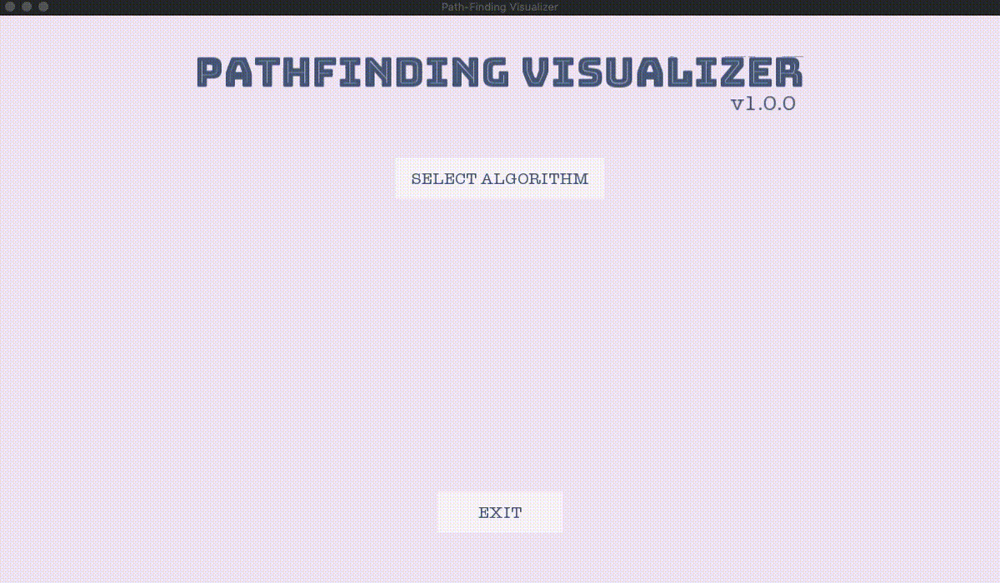

# Pathfinding Visualizer

## Overview

A tool for visualizing numerous pathfinding algorithms. Current implementation of the project involves four search-based planning algorithms: BFS, DFS, DIJKSTRA and A-Star. The project extensively uses SFML and Modern C++ features such as smart pointers, lamda expressions along with multi-threading concepts.



## How to use

- to place/remove obstacle cells (`left-CLICKED`)
- to change starting cell (`left-SHIFT + left-CLICKED`)
- to change end cell (`left-CTRL + left-CLICKED`)

## Dependencies

* cmake >= 2.8
  * All OSes: [click here for installation instructions](https://cmake.org/install/)
* make >= 4.1 (Linux, Mac), 3.81 (Windows)
  * Linux: make is installed by default on most Linux distros
  * Mac: [install Xcode command line tools to get make](https://developer.apple.com/xcode/features/)
  * Windows: [Click here for installation instructions](http://gnuwin32.sourceforge.net/packages/make.htm)
* SFML >= 2.5.1
  * All OSes: [click here for installation instructions](https://www.sfml-dev.org/tutorials/2.5/#getting-started)
  * Linux: Details installation instructions are provided below.
* gcc/g++ >= 5.4
  * Linux: gcc / g++ is installed by default on most Linux distros
  * Mac: same deal as make - [install Xcode command line tools](https://developer.apple.com/xcode/features/)
  * Windows: recommend using [MinGW](http://www.mingw.org/)

## Basic Build Instructions

1. Clone this repo.
2. Make a build directory in the top level project directory: `mkdir build && cd build`
3. Compile: `cmake .. && make`
4. Run it: `./main`.

## SFML Installation on Linux

There are different approaches to the installation of SFML on Linux. For example, on Debian you would do:

`sudo apt-get install libsfml-dev`

>Please note that the minimum version of SFML required in this project is 2.5.1. and at the time of writing you can only install sfml-v2.5.1 directly from debain distribution's package repository for Ubuntu 20.04, otherwise please install it from source.

### SFML Installation from source

For Ubuntu versions less than 20.04., SFML v2.5.1. can only be installed from source. There is a linker error when attempting to compile and link a C++ program with the SFML libraries from souce. You can follow this [thread](https://en.sfml-dev.org/forums/index.php?topic=20638.0) to build SFML. I have also described the same installation instructions below.

1. Download the [SFML source code](https://www.sfml-dev.org/files/SFML-2.5.1-sources.zip). Unpack it. Navigate to the root directory of the unzipped source code.

2. Open the CMakeLists.txt file in the path */src/SFML/Graphics/CMakeLists.txt*.

3. Add the following lines at the end of the file.

  ```
  if(SFML_COMPILER_GCC AND BUILD_SHARED_LIBS)
    message(WARNING "Applying workaround for https://bugs.launchpad.net/ubuntu/+source/gcc-5/+bug/1568899")
    list(APPEND GRAPHICS_EXT_LIBS "-lgcc_s -lgcc")
  endif()
  ```

4. Then **cd** to root dir of unpacked source.

5. Install with the steps below.

  ```
  cmake .
  make all
  sudo make install
  ```

> Note that if you have errors during the `cmake` command, please read the section below which is from [official SFML documentation](https://www.sfml-dev.org/tutorials/2.5/compile-with-cmake.php).

SFML depends on a few other libraries, so before starting to configure you must have their development files installed.

On Windows and macOS, all the required dependencies are provided alongside SFML so you won't have to download/install anything else. Building will work out of the box.

On Linux however, nothing is provided. SFML relies on you to install all of its dependencies on your own. Here is a list of what you need to install before building SFML:

- freetype
- x11
- xrandr
- udev
- opengl
- flac
- ogg
- vorbis
- vorbisenc
- vorbisfile
- openal
- pthread

The exact name of the packages may vary from distribution to distribution. Once those packages are installed, don't forget to install their development headers as well.

## TODO

### Sampling-based planners
- [ ] RRT
- [ ] RRT-Connect
- [ ] RRT*
